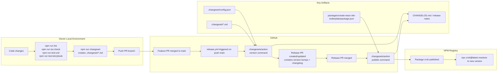

# React Vite Boilerplate


Everything you need to start with your next Vite + React web app! Delighful developer experience with batteries included.

## Demo
[react-vite-boilerplate.webm](https://github.com/user-attachments/assets/d8b86387-9a81-4066-a39c-b72b2d6e40ae)

## [Technical Blog](https://dev.to/singhamandeep007/building-a-production-ready-react-vite-typescript-boilerplate-4ifh)

## Table of Contents

- [Overview](#overview)
- [Requirements](#requirements)
- [Getting Started](#getting-started)
- [Scaffold via npx](#scaffold-via-npx)
- [Scripts](#scripts)
- [Open Source Setup](#open-source-setup)
- [Publishing and Releases](#publishing-and-releases)
- [Release System Diagram](#release-system-diagram)
- [Versioning Guide](#versioning-guide)
- [Owner Release Checklist](#owner-release-checklist)
- [Complete Owner Example](#complete-owner-example)
- [Important Note](#important-note)
- [Testing](#testing)
- [Deployment](#deployment)
- [DevTools](#devtools)
- [Installed Packages](#installed-packages)

## Overview

Built with type safety, scalability, and developer experience in mind. A batteries included Vite + React template.

A more detailed list of the included packages can be found in the [Installed Packages](#installed-packages) section.

## Requirements

- [NodeJS 24.x](https://nodejs.org/en) (see [.nvmrc](.nvmrc))
- [npm](https://www.npmjs.com)

## Getting Started

Getting started is a simple as cloning the repository

```
git clone https://github.com/singhAmandeep007/react-vite-boilerplate.git
```

Changing into the new directory

```
cd react-vite-boilerplate
```

Removing the .git folder (and any additional files, folders or dependencies you may not need)

```
rm -rf .git
```

Installing dependencies

```
npm install
```

And running the setup script (initializes git repository and husky)

```
npm run prepare
```

Congrats! You're ready to starting working on that new project!

**Note**: This project comes with two git hooks added by [husky](https://typicode.github.io/husky/). A pre-commit hook that runs lint-staged and a commit-msg hook that runs commitlint + devmoji. You can simply run `npm run commit` after staging your changes to create automagical ✨ emojified conventional commit message.

If you wish to remove any hooks, simply delete the corresponding file in the .husky directory.

If you want to ignore husky hooks for a specific commit, you can use the `--no-verify` flag. Eg. `git commit -m "your message" --no-verify`

## Scaffold via npx

This template can be scaffolded using the published CLI package:

```sh
npx crvb@latest my-app
```

Then run:

```sh
cd my-app
npm install
npm run dev
```

## Scripts

### App

```sh
npm run dev
npm run build
npm run preview
npm run preview:local:msw
```

### Storybook

```sh
npm run storybook
npm run storybook:build
npm run test:storybook
```

### Tests

```sh
npm test
npm run test:unit
npm run test:unit:coverage
npm run test:unit:watch
npm run test:unit:ui
npm run test:e2e
npm run test:e2e:headless
```

### Code Quality

```sh
npm run lint
npm run format
npm run tsc:check
npm run tsc:watch
```

### Setup

```sh
npm run init:msw
npm run prepare
```

## Open Source Setup

The repository includes standard open-source project files:

- [CONTRIBUTING.md](CONTRIBUTING.md)
- [CODE_OF_CONDUCT.md](CODE_OF_CONDUCT.md)
- [SECURITY.md](SECURITY.md)
- [Issue templates](.github/ISSUE_TEMPLATE)
- [Pull request template](.github/pull_request_template.md)

## Publishing and Releases

This repository uses a two-phase release model powered by Changesets:

1. Changes PR phase: feature work + `.changeset/*.md` entries.
2. Release PR phase: automated version/changelog generation + npm publish.

Primary components:

1. `.changeset/config.json` - versioning/changelog strategy.
2. `.github/workflows/release.yml` - orchestration on `push` to `main`.
3. `packages/create-react-vite-boilerplate/package.json` - publish target (`name: crvb`, `bin`, `files`, `publishConfig`).

### One-time setup

1. Create an npm account and login locally using `npm login`.
2. In GitHub repository settings, add `NPM_TOKEN` as an Actions secret.
3. Ensure your default branch is `main`.
4. Ensure `GITHUB_TOKEN` has workflow default permissions for PR/content updates.

### Release flow

1. Make changes in a feature branch.
2. Add a changeset (this creates release metadata, not a publish):

```sh
npm run changeset
```

3. Merge the feature PR to `main`.
4. Release workflow executes and `changesets/action` creates or updates a Release PR.
5. Merge the Release PR.
6. Publish step runs (`npm run release` -> `changeset publish`) and pushes package `crvb` to npm.
7. Changelog and GitHub release metadata are generated from changeset entries.

Release automation workflow:

- [.github/workflows/release.yml](.github/workflows/release.yml)

## Release System Diagram

The diagram below models control flow, artifacts, and runtime boundaries.



## Versioning Guide

For package `crvb`, use semantic versioning:

1. `patch` (`x.y.Z`): internal fixes, no CLI/API contract change.
2. `minor` (`x.Y.z`): additive functionality, backward compatible CLI behavior.
3. `major` (`X.y.z`): breaking contract change requiring migration.

Mark as `major` when any of these happen:

1. Command rename or removal.
2. Option/flag rename/removal.
3. Scaffold output structure changes that break existing automation/docs.
4. Minimum Node.js requirement increases incompatibly.

## Owner Release Checklist

Follow this exact sequence for each release:

1. Implement your changes.
2. Run local quality checks:

```sh
npm run lint
npm run tsc:check
npm run test:unit
npm run test:storybook
```

3. Create a changeset:

```sh
npm run changeset
```

4. Select package `crvb` and choose patch/minor/major.
5. Write a summary with explicit impact/migration notes.
6. Commit and push your branch.
7. Open and merge a PR to `main`.
8. Wait for GitHub Action to create/update Release PR.
9. Review Release PR diff carefully:
  - package version bump
  - changelog text
  - any generated lockfile changes
10. Merge Release PR to publish on npm.
11. Verify package:

```sh
npm view crvb version
```

12. Verify scaffold command:

```sh
npx crvb@latest my-app
```

## Complete Owner Example

Example: ship `1.0.0` for package `crvb`.

1. You completed feature work in a branch.
2. You ran validation:
  - lint
  - typecheck
  - unit tests
  - storybook tests
3. You created a changeset and selected `major`.
4. Changeset summary captured:
  - breaking command behavior notes
  - migration command example
5. You merged feature PR to `main`.
6. Release workflow created Release PR with generated version and changelog updates.
7. You reviewed and merged Release PR.
8. Publish executed in CI using `NPM_TOKEN`.
9. Verification:
  - `npm view crvb version` returns `1.0.0`
  - `npx crvb@latest demo-app` scaffolds successfully

## Important Note

1. This boilerplate project includes a recommended folder structure for organizing your application code in logical and opinionated way.

The folder structure is as follows:

```

├── .storybook
├── cypress
│   ├── downloads
│   ├── fixtures
│   ├── specs
│   ├── support
|   └── tsconfig.json
├── env
├── public
├── src
│   ├── __mocks__
│   ├── app
│   ├── api
│   ├── assets
│   ├── components
│   │   ├── forms
│   │   ├── hooks
│   │   ├── layout
│   │   ├── ui
│   │   └── developmentTools.tsx
│   ├── config
│   ├── mocker
│   ├── modules
│   │   └── i18n
│   ├── pages
│   │   ├── app
│   │   ├── home
│   │   └── auth
│   ├── routes
│   ├── store
│   │   └── auth
│   ├── tests
│   ├── types
│   ├── utils
│   └── index.css
│   └── main.tsx
├── index.html
├── .editorconfig
├── eslint.config.js
├── prettier.config.js
├── cypress.config.js
├── tailwind.config.js
├── .gitignore
├── tsconfig.json
├── vite.config.ts
└── package.json

```

2. There are README files which contain simple descriptions about how the different directories in the accompanying folder structure may be used. As an example check out the [recommended component organizational structure](src/components/README.md).

Storybook-specific configuration and usage are documented in [.storybook/README.md](.storybook/README.md).

## Testing

### Unit Testing

Unit testing is handled by React Testing Library and Vitest.

If you'd like to run Unit tests, execute the following command:

```sh
npm run test:unit

# or with coverage
npm run test:unit:coverage

# or in watch mode
npm run test:unit:watch

# or in ui mode
npm run test:unit:ui
```

Testing types is also supported with vitest and this application is set up to run tests for types using it. By default all tests inside `*.test-d.ts` files are considered type tests.

### Storybook Testing

Component stories can be tested with Vitest through Storybook.

```sh
npm run test:storybook
```

Accessibility checks are enabled for story tests and configured to fail on violations.

### End-to-End (E2E) Testing

End-to-End (E2E) Testing is conducted by Cypress.

If you'd like to run E2E tests, execute the following command:

```sh
npm run test:e2e

# or in headless mode
npm run test:e2e:headless
```

### Continuous Integration

Github Actions has been set up to run tests on every push to the repository. The configuration can be found in the `.github/workflows` directory.

Workflow for cypress tests is located in `.github/workflows/cypress.yml`.

## Devtools

This project includes a set of Devtools. Some are additional package dependencies whereas others come built-in to the packages themselves.

### Devtool dependencies:

- [@tanstack/react-query-devtools](https://tanstack.com/query/v4/docs/react/devtools) - Dedicated dev tools to help visualize the inner workings of React Query
- [@tanstack/router-devtools](https://tanstack.com/router/v1/docs/devtools) - Dedicated dev tools to help visualize the inner workings of TanStack Router
- [@hookform/DevTools](https://react-hook-form.com/dev-tools) - React Hook Form Devtools to help debug forms with validation

A set of utility components are provided in [developmentTools.tsx](src/components/developmentTools.tsx). These [wrapper components](https://tanstack.com/router/v1/docs/framework/react/devtools#only-importing-and-using-devtools-in-development) check whether the application is running in development or production mode and render the component or null respectively. In other words, you can confidently use them during development without having to worry about them showing up for end users in production.

**TanStack Query Devtools** are ready to go out of the box. The development vs. production rendering mechanism is built into the devtools. If you do wish to [render the devtools in production](https://tanstack.com/query/latest/docs/react/devtools) you can freely do so by following the TanStack Query Devtools documentation. The devtools component can be found in [App.tsx](/src/app/App.tsx).

When running the application in development mode you can find the TanStack Query Devtools icon in the bottom left corner of the page sporting the [React Query Logo](https://img.stackshare.io/service/25599/default_c6db7125f2c663e452ba211df91b2ced3bb7f0ff.png).

**TanStack Router Devtools**, however, utilizes its respective utility component in this project. The initial setup has been taken care of but if you wish to modify or remove the component, have a look in [src/routes\_\_root.tsx](/src/routes/__root.tsx).

The TanStack Router Devtools icon can be found in the bottom left corner of the page denoted by "Tanstack Router" logo.

**React Hook Form DevTools** icon can be recognized in the top left corner of the page by the pink React Hook Form clipboard logo. A prop must be passed from a specific hook to enable it. In this case, it is the `control` prop from the `useForm()` hook. Use of React Hook Form DevTools requires the component be added to each unique form. More information can be found in the [React Hook Form DevTools documentation](https://react-hook-form.com/dev-tools).

To reiterate, if you wish to restrict the Devtools to development builds use the provided components found at [src/components/utils/developmentTools](/src/components/utils/developmentTools.tsx) instead of the built-in components from their respective modules.

## Installed Packages

### Base

- [TypeScript](https://www.typescriptlang.org) - Typed superset of JavaScript
- [Vite](https://vitejs.dev) - Feature rich and highly optimized frontend tooling with TypeScript support out of the box
- [React](https://react.dev) - A modern front-end JavaScript library for building user interfaces based on components

### Routing

- [TanStack Router](https://tanstack.com/router/latest) - Fully typesafe, modern and scalable routing solution for react applications.

### Linting & Formatting

- [ESLint](https://eslint.org) - Static code analysis to help find problems within a codebase
  - [typescript-eslint](https://typescript-eslint.io)
  - [eslint-plugin-react](https://github.com/jsx-eslint/eslint-plugin-react#readme)
  - [eslint-plugin-react-hooks](https://www.npmjs.com/package/eslint-plugin-react-hooks)
  - [eslint-plugin-react-refresh](https://github.com/ArnaudBarre/eslint-plugin-react-refresh)
  - [eslint-plugin-cypress](https://github.com/cypress-io/eslint-plugin-cypress#readme)
  - [eslint-plugin-storybook](https://github.com/storybookjs/eslint-plugin-storybook#readme)
  - [eslint-plugin-testing-library](https://github.com/testing-library/eslint-plugin-testing-library)
- [Prettier](https://prettier.io) - Code formatter
  - [prettier-plugin-organize-imports](https://github.com/simonhaenisch/prettier-plugin-organize-imports#readme)
  - [prettier-plugin-tailwindcss](https://github.com/tailwindlabs/prettier-plugin-tailwindcss#readme)

### State Management

- [TanStack React Query](https://tanstack.com/query/latest) - Powerful asynchronous state management, server state caching, and data fetching library
- [Zustand](https://zustand-demo.pmnd.rs) - A small, fast and scaleable bearbones state-management solution using flux principles.
  - Provides a built-in [devtools middleware](https://github.com/pmndrs/zustand#redux-devtools)

### Utils

- [Radash](https://radash-docs.vercel.app/docs/getting-started) - A powerful utility library with functions having strong types and zero dependencies
- [date-fns](https://date-fns.org/) - Modern JavaScript date utility library
- [ky](https://github.com/sindresorhus/ky#readme) - A tiny and elegant HTTP client which provides cool benefits over plain fetch

### Internationalization

- [i18next-browser-languageDetector](https://github.com/i18next/i18next-browser-languageDetector)
- [i18next](https://www.i18next.com/)
- [react-i18next](https://react.i18next.com/) - A powerful internationalization framework for React/React Native based on i18next

### UI

- [Tailwind CSS](https://tailwindcss.com) - A utility-first CSS framework packed with classes to build any web design imaginable
- [Shadcn UI](https://ui.shadcn.com/) - A set of beautiful and accessible React components
- [Lucide](https://lucide.dev/)
- [Storybook](https://storybook.js.org) - A frontend workshop for building UI components and pages in isolation

### Forms

- [React Hook Form](https://react-hook-form.com) - Performant, flexible and extensible forms with easy-to-use validation
- [Zod](https://zod.dev) - TypeScript-first schema validation with static type inference

### Testing

- [Vitest](https://vitest.dev) - Vitest is a fast testing framework for modern web applications with first-class support for TypeScript and Vite
- [React Testing Library](https://testing-library.com) - A very light-weight, best practice first, solution for testing React components
- [Cypress](https://www.cypress.io/) - A powerful end-to-end testing framework that simplifies and accelerates web application testing
- [MSW](https://mswjs.io/) - Industry standard API mocking for JavaScript designed to work across any frameworks, tools, and environments

### Development Tools

- [TanStack Query Devtools](https://tanstack.com/query/latest/docs/react/devtools?from=reactQueryV3&original=https%3A%2F%2Ftanstack.com%2Fquery%2Fv3%2Fdocs%2Fdevtools)
- [TanStack Router Devtools](https://tanstack.com/router/v1/docs/devtools)
- [React Hook Form Devtools](https://react-hook-form.com/dev-tools)

### Git

- [Husky](https://github.com/typicode/husky#readme) - Automatically lint your commit messages, code, and run tests upon committing or pushing.
- [Commitizen](https://github.com/commitizen/cz-cli#readme) - Conventional commit messages CLI
- [lint-staged](https://github.com/lint-staged/lint-staged#readme) - Run linters against staged git files and don't let 💩 slip into your code base!
- [Devmoji](https://github.com/folke/devmoji#readme) - A CLI tool to help you write conventional commit messages with emojis

### Other

- [Faker](https://fakerjs.dev/) - Generate massive amounts of fake (but realistic) data for testing and development
